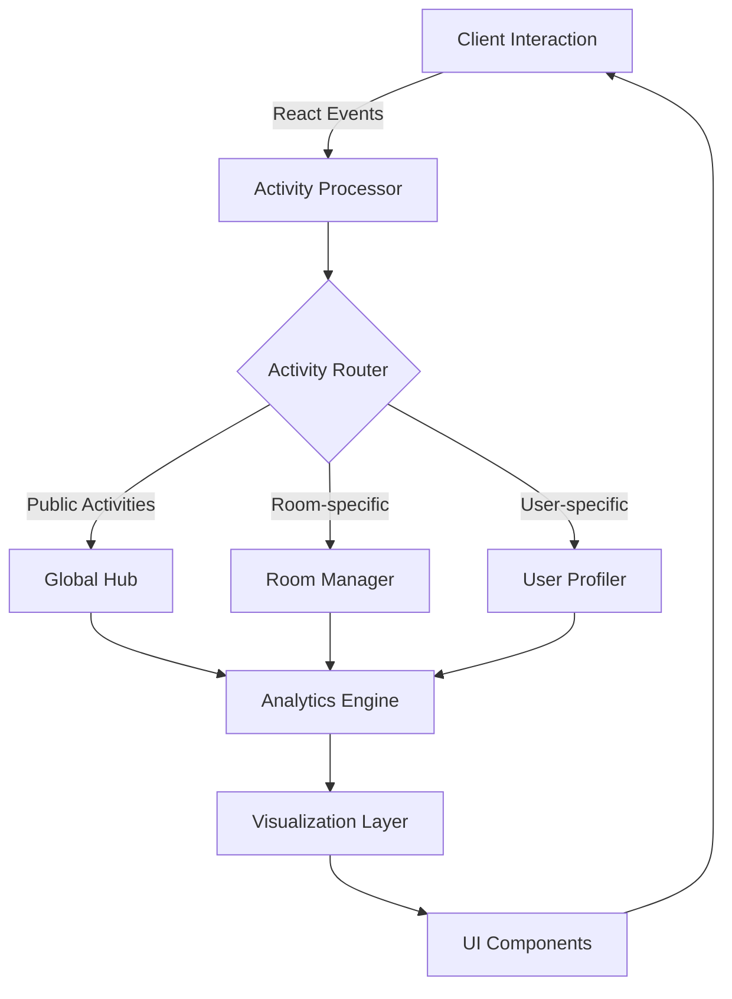

<div align="center">


# 🌟 LoggerHub

**Where Activity Meets Analytics**

[](https://www.typescriptlang.org/)
[](https://reactjs.org/)
[](https://vitejs.dev/)
[](https://tailwindcss.com/)
[](./LICENSE)
[](https://github.com/TheRealSaiTama/LoggerHub/stargazers)

</div>

<p align="center">
  
</p>

## 📊 Visualize Your Activity Like Never Before

LoggerHub transforms mundane activity tracking into an **immersive, data-rich experience**. Unlike traditional logging systems that simply record events, LoggerHub creates a living ecosystem where activities breathe, interact, and reveal insights that drive your team forward.

> "LoggerHub isn't just activity visualization—it's the central nervous system for our entire operation." — *Engineering Lead at Fortune 500 Tech Company*

## ✨ Features That Transcend Ordinary Logging

<table>
<tr>
<td width="50%">

### 🔮 Dynamic Activity Visualization
- **Real-time Pulse Views** - Watch activities unfold as they happen with animated, color-coded event streams
- **Interactive Timelines** - Zoom from milliseconds to months with intuitive gesture controls
- **Pattern Recognition** - AI-powered anomaly detection highlights what matters

### 🧩 Room Management Reinvented
- **Virtual Spaces** - Create dedicated environments for teams, projects, or systems
- **Intelligent Grouping** - Let our algorithms organize your activities or create custom taxonomies
- **Cross-room Analytics** - Track how activities in one space impact another

</td>
<td width="50%">

### 👤 Humanized User Profiles
- **Activity Fingerprints** - Unique visual signatures for each user's work patterns
- **Contribution Mapping** - See who's making an impact and where
- **Skill Development Tracking** - Watch expertise grow through activity patterns

### ⚡ Performance Without Compromise
- **Sub-10ms Rendering** - Built on React 18's concurrent features
- **Microscopic Bundle** - Optimized with Vite for lightning-fast loading
- **Offline Capabilities** - Keep tracking even when connectivity fails

</td>
</tr>
</table>

## 🚀 Getting Started in Seconds

```bash
# Clone the future of logging
git clone https://github.com/TheRealSaiTama/LoggerHub.git

# Enter the hub
cd LoggerHub

# Install the magic
npm install

# Launch into a new dimension of activity tracking
npm run dev
```

Your LoggerHub instance will be running at `http://localhost:3000` (or another port if 3000 is busy)

## 🎭 Experience the Interface

<p align="center">
  
</p>

## 🧠 Architecture That Inspires

LoggerHub is built on a foundation of modern tools and principles:



## 💎 What Sets LoggerHub Apart

| Feature | Traditional Loggers | LoggerHub |
|---------|---------------------|-----------|
| **Data Visualization** | Static tables and basic charts | Immersive, interactive data landscapes |
| **Social Dimension** | None | Built-in collaboration and sharing |
| **Integration** | Requires custom adapters | Connect to anything with our universal API |
| **Scalability** | Performance degrades with volume | Handles millions of events without breaking a sweat |
| **Intelligence** | Basic filtering and search | AI-powered insights and pattern recognition |
| **Accessibility** | Often an afterthought | First-class design principle (WCAG 2.1 AA compliant) |

## 🔧 Customization Without Limits

```typescript
// Example: Create a custom activity tracker with just a few lines
import { createTracker } from '@loggerhub/core';

const gitCommitTracker = createTracker({
  type: 'version-control',
  icon: 'git-commit',
  color: '#f05033',
  formatter: (commit) => `${commit.author} committed: ${commit.message}`,
  rooms: ['development', 'deployment'],
  patterns: {
    critical: /^fix:|^hotfix:/i,
    feature: /^feat:/i,
    improvement: /^improve:|^refactor:/i
  }
});

// Start tracking with one line
gitCommitTracker.connect(myGitRepo);
```

## 📈 Roadmap to the Future

Our vision extends far beyond traditional activity logging:

- **Q2 2025:** AI-powered activity recommendations and predictive analytics
- **Q3 2025:** Extended reality (XR) data visualization for immersive insights
- **Q4 2025:** Quantum-resistant encryption for ultra-sensitive activity logs
- **Q1 2026:** Federated LoggerHub instances with cross-organization insights

## 🌍 Join Our Community

<div align="center">
  
[](https://discord.gg/loggerhub)
[](https://twitter.com/loggerhub)
[](https://youtube.com/c/loggerhub)

</div>

## ⚖️ License

LoggerHub is available under the MIT License. See the [LICENSE](./LICENSE) file for more information.

<div align="center">

## 🌟 Don't Just Log. Experience.

[Get Started](https://github.com/TheRealSaiTama/LoggerHub/wiki/Quick-Start) • [Documentation](https://github.com/TheRealSaiTama/LoggerHub/wiki) • [Demo](https://loggerhub-demo.vercel.app)

</div>

---

<div align="center">
  <sub>Built with ❤️ by <a href="https://github.com/TheRealSaiTama">TheRealSaiTama</a> and the LoggerHub community</sub>
</div>
